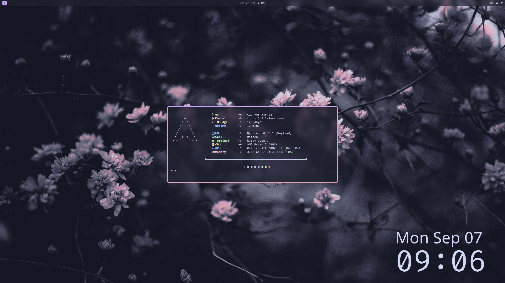
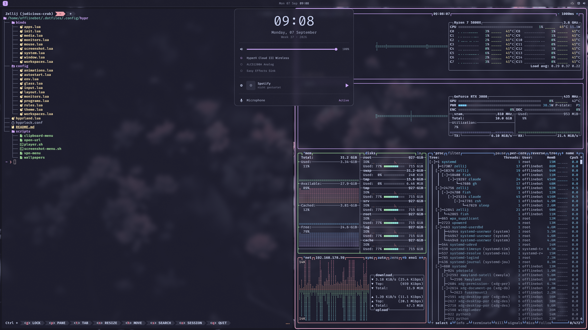
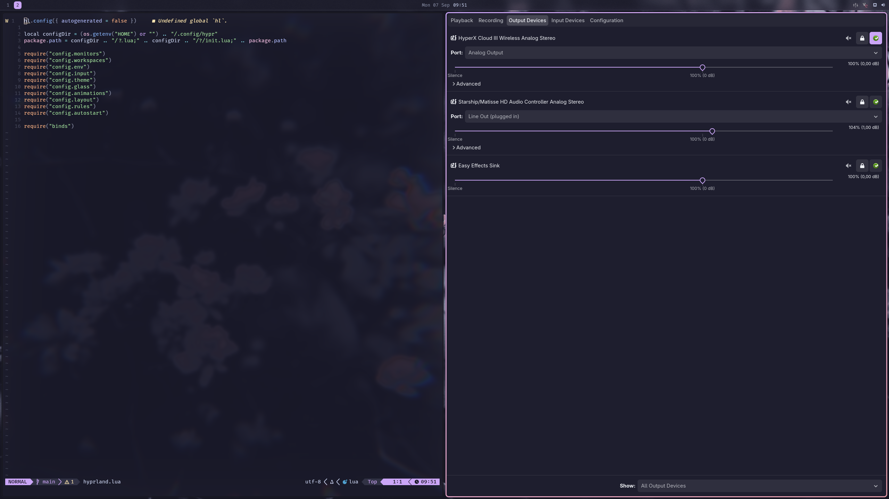

# my dotfiles

hyprland with a lua config, quickshell for the bar, launcher and overview,
kitty + fish on the terminal side. running on cachyos.





also in here: niri and mango configs from trying stuff out, zellij, tmux,
mako, nvim, micro, btop, bat, fastfetch, zathura and a few wallpapers.

## install

`./install.sh` asks before every step: installs stow, links all configs into
$HOME, then installs the packages below. whatever is still missing gets
listed at the end. you can also just copy over what you want.

## packages

```
wm/desktop  hyprland hyprlock niri quickshell awww xwayland-satellite mako
terminal    kitty fish zellij tmux neovim micro
tools       btop fastfetch zathura nwg-look fzf fd ripgrep bat eza zoxide
            jq playerctl grim slurp wl-clipboard wl-clip-persist cliphist
apps        firefox nautilus pavucontrol spotify-launcher vesktop spicetify
misc        wireguard-tools ttf-firacode-nerd catppuccin gtk theme + cursors
            easyeffects (flatpak)
```
