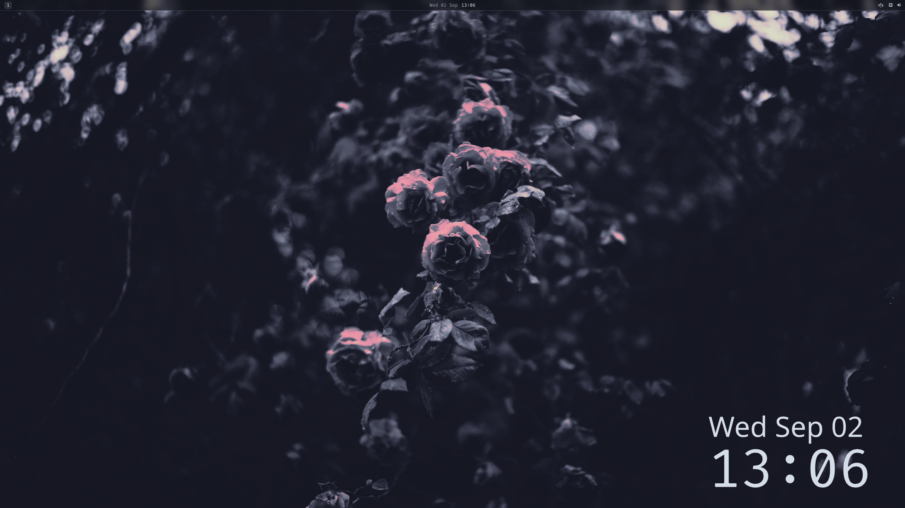
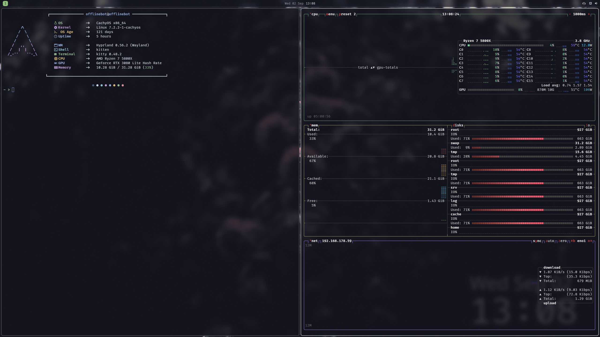

# cachyrice

my cachyos dotfiles. hyprland with a lua config, quickshell for the bar,
launcher and overview, kitty + fish for the terminal side.

also in here: niri and mango configs from trying stuff out, zellij, tmux,
mako, nvim, micro, btop, bat, fastfetch, zathura and a few wallpapers
(`Pictures/wallpapers`, used by `hypr/scripts/wallpapers`).

configs live under `.config`. `./install.sh` links everything with stow and
installs the packages (pacman, aur via paru, easyeffects via flatpak) —
or just copy over what you want. `screenshots/` is only for this README,
`fish_variables` is machine-local and gitignored.
